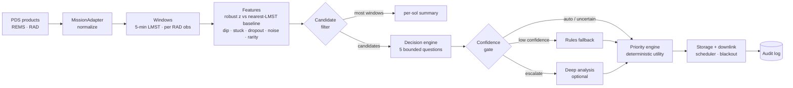

# DEEPSIFT

**Autonomous downlink research for bandwidth-constrained missions.**

> *Not every bit deserves the trip to Earth.*

DEEPSIFT is an independent research prototype. It replays archived Mars Science Laboratory (Curiosity) data from the
NASA Planetary Data System under simulated bandwidth limits, and measures which signals actually help decide what should
be transmitted. It is not flight software and is not affiliated with, used by or validated by NASA or JPL.

| | |
|---|---|
| **What is this?** | A pre-registered, retrospective study of rover-imagery downlink prioritization on public Curiosity Navcam data. |
| **What was tested?** | Semantic ranking (Jev), telemetry ranking, pHash, a learned quality detector, image embeddings, rover-position sampling, and three downlink schedulers. |
| **What happened?** | Only rover-position sampling and a stereo-safe progressive scheduler generalized. On the held-out test: 26.1 % of full-quality traverse bytes, 100 % 5 m coverage, 0 broken stereo pairs. |
| **Where is the evidence?** | [`docs/deepsift-paper.md`](docs/deepsift-paper.md) · [`docs/phase3-final-test-report.md`](docs/phase3-final-test-report.md) · [`artifacts/phase3_final/`](artifacts/phase3_final/) · [`docs/public-claims-checklist.md`](docs/public-claims-checklist.md) |
| **How do I reproduce it?** | `uv run python scripts/release_integrity.py --verify` then see [Reproducibility](#reproducibility). Raw PDS data are re-downloadable via `scripts/fetch_navcam.py` and the committed manifests. |
| **Limits?** | Only downlinked (archived) data exist; one rover and one camera; simulated compressed tier; see [Limitations](#limitations-read-before-quoting-a-number). |

## Final held-out result

**Test:** Curiosity Navcam, sols 950–979 (12 traverse sequences, 679 archived frames). The configuration was committed
before the first test image was downloaded, and the analysis ran once.

At **1/4 traverse-frame retention**, Scheduler V3 + POSITION achieved:

| | result | pre-registered criterion |
|---|---|---|
| full-quality traverse bytes | **26.1 %** | ≤ 35 % |
| 5 m spatial coverage | **100 %** (1.000) | ≥ 90 % |
| maximum distance from any archived frame to a kept frame | **2.05 m** | ≤ 10 m in every traverse |
| broken stereo pairs | **0** | 0 |
| Scheduler V3 monotonicity violations | **0** | 0 |

**Primary criterion: PASS.**

> On a held-out Curiosity Navcam interval, position-based traverse sampling with a stereo-safe progressive scheduler
> kept 1/4 of traverse frames at full quality, using 26.1 % of full-quality traverse bytes, while every archived
> traverse frame stayed within 5 m of a kept frame (at most 2.05 m) and no stereo pair was broken.

Sources:
- `artifacts/phase3_final/20260926T174018-phase3-final-test-e4e2/results.json`;
- config `config/phase3_final_test_config.json` (hash `6f35d7fc…`, commit `96e0694`), result commit `fdc2122`.

## What we learned

- **Simple mission geometry generalized.** Rover-position sampling kept 5 m coverage at 1.000 in development,
  validation 1, validation 2 and the held-out test.
- **Semantic ranking did not.** A semantic decision model (Jev) did not improve candidate ranking and was discontinued
  by a pre-registered stop rule.
- **Image embeddings detected change but did not improve final selection meaningfully.** Their visual-change gain over
  POSITION was +0.044 in development, then +0.004, +0.001 and +0.005, against a pre-registered +0.020 threshold.
- **More complexity was not automatically better.** Every added signal had to survive data it was not tuned on; most
  did not.

## What didn't work

| component | outcome |
|---|---|
| **Jev semantic ranking** | AUROC difference vs deterministic rules +0.006 (95 % CI −0.020 to +0.037) over 1,500 live calls; discontinued for ranking. A later text-only pairwise probe was stable but agreed with no strategy; auxiliary diagnostic only. |
| **Telemetry image ranking** | Image-independent by construction; weakest coverage of six strategies (at 1 % under Scheduler V3: 7 usable acquisitions at 1 rover position). |
| **pHash representative selection** | Constrained pHash merged different scenes at 0.15–0.19 on validation (limit 0.05) and compressed traverses by at most 1.03×. |
| **QUALITY_V2 generalization** | False-positive rate 3.6 % in development → 10.6 % on validation, mostly upward-pointing, low-texture frames. Kept only as a diagnostic `QUALITY_SUSPECT` flag. |
| **Embedding-assisted ranking** | No measurable added value outside development; spatially looser than POSITION (largest distance 4.89 m vs 2.05 m on the test). |
| **Earlier schedulers** | V1 was non-monotonic (more budget could lose coverage); V2 dropped stereo. Both were superseded by V3. |

## Research timeline

| stage | tag |
|---|---|
| Phase 1 · telemetry triage prototype | `v0.1-baseline` |
| Phase 2 · Jev semantic decision evaluation | `phase2-complete` |
| Phase 3 · Navcam downlink baseline | `phase3-baseline` |
| Phase 3.1 · controlled visual tests (synthetic controls) | `phase3.1-complete` |
| Phase 3.2 · stereo-safe Scheduler V3 | `phase3.2-complete` |
| Phase 3.3 · validation 1 (sols 779–820), config frozen first | `phase3.3-config-frozen` → `phase3.3-complete` |
| Phase 3.4 · simplification + fresh validation 2 (sols 1100–1129) | `phase3.4-config-frozen` → `phase3.4-validation2-frozen` → `phase3.4-complete` |
| Final held-out test (sols 950–979) | `phase3-final-test-config-frozen` → `phase3-final-test-complete` |
| Research release | `deepsift-v1-research` |

## Read more

| document | content |
|---|---|
| `docs/deepsift-paper.md` | technical paper: abstract, method, results, negative results, limitations |
| `docs/phase3-final-test-report.md` | final held-out test report |
| `docs/phase3.3-report.md`, `docs/phase3.4-report.md` | validation reports |
| `docs/figures/` | figures 1–5, drawn from frozen artifacts by `scripts/make_release_figures.py` |
| `docs/demo-script.md` | 60-second demo script |
| web app | `/` result · `/final-test` historical replay · `/research` · `/reproducibility` · `/limitations` · `/telemetry` (Phase 1–2 archive) |

## Reproducibility

```bash
uv run python scripts/release_integrity.py --verify    # SHA-256 of 70 scientific artifacts (docs/release/science-artifacts.json)
uv run python scripts/run_phase3_final_test.py --stage analysis --run artifacts/phase3_final/20260926T174018-phase3-final-test-e4e2
uv run python scripts/build_release_data.py            # web data, from frozen artifacts only
uv run python scripts/make_release_figures.py          # figures, from frozen artifacts only
```

Each runner:
- refuses to start if its frozen config hash or any listed source file changed;
- takes every seed from its config;
- keeps periods separate, never pooled.

Raw PDS products are not committed. They can be re-downloaded from the URLs in `data/manifests/navcam_*.json` and are
verified by SHA-256.

## Limitations (read before quoting a number)

- **PDS survivorship bias.** The archive holds only downlinked observations. This is retrospective re-prioritization,
  not reconstruction of the onboard image stream.
- **Simulated compressed tier.** Scheduler V3's compressed stereo tier is a *simulated product tier* (JPEG q50), not a
  NASA flight product. Traverse results use only label-estimated full and thumbnail tiers.
- **Interpolated positions.** Positions are PLACES interpolations (mostly the nearest pose within a drive), not
  per-frame onboard localization.
- **Narrow scope.** One rover, one camera (Navcam), traverse sequences only, four sol windows.
- **Proxy metrics.** Visual-change coverage is an embedding proxy, and spatial coverage is geometric. Neither measures
  scientific value.
- **No hardware model.** No flight hardware, power, thermal or compute-budget model.
- **No NASA validation.**
- **Single-use test.** The held-out test interval is used up; a modified method needs a new, untouched test interval.

---

# Phase 1–2 documentation (historical record)

The sections below describe the original REMS/RAD telemetry-triage system and the Phase 2 Jev evaluation. They are kept
for the record.

> **Onboard vs cloud.** The Jev engine was API-hosted (via OpenRouter). Its latency and cost describe a ground-based API
> call, not an onboard processor. The local edge baseline is the only decision model here that runs without a network.

## Architecture

```
/apps/web                 Next.js 16 · TypeScript · Tailwind v4 — Mission Control UI
/services/pipeline
  deepsift/core           typed event model (pydantic), versioned config
  deepsift/adapters       MissionAdapter interface + CuriosityAdapter (REMS MODRDR, RAD RDR)
  deepsift/features       windowing, diurnal baselines, robust z, dips, quality flags, novelty, detection
  deepsift/decision       DecisionEngine (Mock, Jev), bounded questions, state builder, gating, DeepAnalysisProvider
  deepsift/objectives     mission objectives as structured config
  deepsift/priority       deterministic utility, action policy, explanations, counterfactuals
  deepsift/simulation     storage + downlink scheduler + blackout (discrete-event)
  deepsift/evaluation     anomaly injection, labels, 5 strategies, metrics, benchmark harness
  deepsift/audit          DuckDB audit log (decisions, runs, config versions, labels)
  deepsift/api            FastAPI service
  tests/                  58 pytest tests
/config                   default.yaml (all thresholds/weights/budgets), objectives.yaml
/data/raw                 PDS download cache + manifest.json (URLs, sizes, sha256) — git-ignored
/data/fixtures            real PDS sample, sols 238–243 (gzip) — offline fallback, LOCAL NASA SAMPLE
/data/labels              documented_events.yaml
/scripts                  fetch_nasa.py, run_pipeline.py, run_benchmark.py, demo.sh
/docs                     architecture.md, research-methodology.md, leakage-audit.md, ground-truth.md, jev-evaluation.md
```

The requested `packages/{core,mission-adapters,decision-engine,simulation,evaluation}` split is kept
as sub-packages of one Python package (`deepsift.*`) — same boundaries, no multi-package build overhead.

### Pipeline



## Dataset

| | |
|---|---|
| Mission | Mars Science Laboratory / Curiosity, Gale Crater |
| Segment | sols 232–251 (2013-04-01 → 2013-04-21) |
| REMS | `MSL-M-REMS-5-MODRDR-V1.0`, PDS Atmospheres Node — pressure, ambient air temperature, ground brightness temperature, UV-ABC, relative humidity (≈1 Hz bursts, 372-byte ASCII records) |
| RAD | `MSL-M-RAD-3-RDR-V1.0`, PDS PPI Node — total dose rate B and E (µGy/h), one value per ~1 h integration |
| Volume | 20 REMS + 20 RAD products, 294 MB raw, 1.43 M channel samples |
| Documented event | 2013-04-11 solar particle event (sol 242) — dose B rises from ~9.1 to 12.13 µGy/h in the RDR |

Timing: REMS UTC comes from each label's spacecraft-clock/UTC pair. RAD local time is derived from
`START_OBS_UTC` via a linear fit to the REMS UTC↔LMST relation, because the RAD `START_OBS_MARS` field
does not advance per observation in these products. The fit recovers a sol length of 88,775.244 s
(known value 88,775.244 s) with < 0.5 s residual.

**Data provenance is always visible**: `NASA PDS · REAL DATA` (downloaded), `LOCAL NASA SAMPLE`
(bundled real bytes), or `SYNTHETIC TEST DATA`. Real data is never silently replaced. Synthetic
anomalies are injected only in benchmark copies and are tagged on every sample, event and label.

## How Jev is used

[Jev](https://docs.typesafe.ai/) is TypeSafe AI's "System One" decision model. DEEPSIFT uses it only
through `deepsift/decision/jev.py`, via the official `typesafe-sdk` (0.7.1, wire schema generated from
`api.typesafe.ai/openapi.json`):

```python
client.system_one(state=<compact event state>, questions={...}, model="jev-latest")
# ChoiceAnswer(choice, confidence, probabilities) · NoulAnswer(noul) · usage.input_tokens
```

Five bounded questions per candidate (`deepsift/decision/questions.py`):

| question | type | options |
|---|---|---|
| `science_value` | choice | none · low · medium · high · critical |
| `event_type` | choice | nominal · atmospheric · radiation · thermal · instrument_anomaly · unknown |
| `downlink_action` | choice | discard · summary_only · compress · full_data |
| `needs_deep_analysis` | noul | P(yes) |
| `instrument_failure` | choice | yes · no · uncertain |

Design choices driven by TypeSafe's own guidance:

* **State, not raw rows.** The engine sees aggregated features; every number is paired with a
  deterministic qualitative descriptor ("+14.0 sigma — extremely far above normal") because Jev is
  documented as weak with raw numbers and dates.
* **Objective-independent questions.** The mission objective is applied in code to the returned
  probabilities, so switching objectives re-scores stored decisions with **zero** new engine calls.
* **Probabilities are persisted** exactly as returned, with latency, token usage and cost.

### Why Jev is NOT used for generation

Decisions here must be comparable, gateable and reproducible. Bounded answers with probabilities can be
thresholded, audited and re-scored; prose cannot. Explanations ("Why was this selected?") are assembled
from features, config and decision metadata. The only model-generated text in the system is the optional
deep-analysis rationale, which is always labelled `MODEL-GENERATED TEXT`.

### Mock mode

With `decision_engine.kind: auto` (default) and no `TYPESAFE_API_KEY`, the pipeline uses `MockDecisionEngine` — a transparent, deterministic
heuristic that returns the same answer shapes. Every UI surface and benchmark row that depends on it is
labelled `ENGINE MOCK · HEURISTIC` / "(mock)". **Mock results are not evidence about Jev.**

### Code owns the action

```
utility = (1 − λ(1 − confidence)) × Σ w_k · term_k
          terms: science_value (E[value] under the engine distribution) · mission_relevance
                 (objective weights × P(type)) · anomaly_strength (1 − e^(−dev/6)) · novelty
action  = thresholds(utility) → floors (uncertain gate ⇒ ≥ SUMMARY; P(instrument failure) ≥ 0.6 ⇒ ≥ SUMMARY)
          → engine may raise the action by one level only when gated AUTO
storage = degrade lowest utility-per-byte first; products with utility ≥ FULL threshold degraded last
```

Confidence gating: `≥ 0.90` automatic · `0.70–0.90` kept but flagged uncertain · `< 0.70` deterministic
rules (or deep analysis if a provider is configured). All values live in `config/default.yaml`.

## Benchmark methodology (summary)

Five strategies run on the same 20 sols with the same byte budget (2 passes/sol × 32 KiB × sols) and the
same greedy allocator: **random sampling**, **threshold rules**, **statistical anomaly detection**,
**decision engine**, **engine + deep analysis** (reported UNAVAILABLE without a provider). Labels are one
documented event plus nine kinds of synthetic injections per trial, placed with a seed. Full details and
caveats: [`docs/research-methodology.md`](docs/research-methodology.md).

> **Superseded.** The v0.1 benchmark below leaked: thresholds, injection magnitudes and one storage
> policy were tuned on the same sols it evaluates (`docs/leakage-audit.md`). It is kept as a development
> record. The Phase-2 held-out evaluation is summarised in the next section.

**v0.1 development result (2026-09-24, Apple M5, 5 seeds, engine = mock heuristic, NOT Jev)** —
experiment `20260924T190246-8a4f1b`:

| strategy | recall | high-severity recall | retained-but-unlabeled¹ | value/MB (proxy)² |
|---|---|---|---|---|
| random sampling | 20.9 % | 25.0 % | 95.5 % | 8.6 |
| threshold rules | **51.8 %** | **73.3 %** | 69.7 % | 18.1 |
| statistical anomaly | 15.5 % | 11.7 % | 92.3 % | 5.8 |
| decision engine (mock) | 45.5 % | 68.3 % | 71.3 % | **18.8** |
| engine + deep | unavailable | | | |

¹ upper bound on the false-positive rate (unlabeled real phenomena exist). ² Σ severity × assumed
fidelity per downlinked MB — a proxy, not a measure of scientific value.

In this configuration **simple rules beat the heuristic engine on recall**. Whether Jev beats the rules is
exactly what the harness is for; it has not been measured here because no API key was available.

Measured pipeline performance on the same machine (`npm run pipeline`): 1.43 M samples preprocessed in
≈4.3 s (≈330 k samples/s, of which ≈3.9 s is ASCII parsing); windowing + features + detection ≈ 290 ms;
126 candidates from 1,922 instrument windows; mock-engine decisions ≈ 0.015 ms each (Python function
time, not model inference); 99.5 % data reduction under the default budget.

## Phase 2: held-out evaluation

* Temporal splits: calibration (sols 232–251) → validation (412–430, 779–820) → **test** (732–750,
  871–930, 2068–2105), each held-out segment with a never-scored baseline warm-up (`data/splits/splits.json`).
* Thresholds derived label-free from calibration only (`scripts/calibrate.py`); gating thresholds frozen
  on validation by a pre-declared rule; test run once.
* Ground truth: 121 Forbush decreases (Guo et al. 2018), 16 surface SEP dates (Löwe et al. 2025), MY34
  dust-storm phases (Viúdez-Moreiras et al. 2019); sol 242 verification record (`docs/ground-truth.md`).
* 1,852 synthetic injections on test in declared difficulty buckets; strict / tolerant / coverage metrics;
  RANDOM over 30 seeds; ORACLE — NOT DEPLOYABLE; LOCAL EDGE BASELINE (1.6 KB logistic model, no network).
* Jev was evaluated only on validation, in staged pilots (see "Phase 2 conclusion" below); it was never run on
  the held-out test.

Held-out findings (mock engine, not Jev): candidate detection caps every event-based strategy at 63–68 %
high-severity synthetic recall; above ~1 % of raw bytes a no-AI rules + statistical hybrid leads (73 → 100 %);
at 0.5 % the mock engine reaches 60 % vs rules 50 % and the local edge model 53 %; documented Forbush
decreases are not isolated by the detector (≈2 % data coverage, random 7 %); the v0.1 protected-tier storage
policy preserves *fewer* high-severity synthetic events at 1–4 MiB. Full report: `docs/jev-evaluation.md`;
UI: `/study`; artifacts: `artifacts/runs/`, `artifacts/figures/`.

## Phase 2 conclusion (tag `phase2-complete`)

On the validation experiment, Jev 1.13 did not provide a measurable improvement in candidate-event ranking over deterministic baselines or the local edge model. Under the pre-registered stop rule, Jev was discontinued for the ranking role.

This result applies only to this experiment and task (ranking already-detected REMS/RAD candidate events on DEEPSIFT's validation split, with the state representations and questions tested). It is not a general claim about Jev. All Jev code, runs, call logs, the inference cache and the evaluation documents are preserved for reproducibility. Jev is not part of the default active ranking path going forward (opt-in only: `DEEPSIFT_EXPERIMENTAL_JEV=1` or `scripts/run_study.py --experimental-jev`).

Evidence: validation pilots `20260925T091126-jev-pilot-7351` (q1 schema, degenerate answers),
`20260925T092458-jev-wording-q2-d559` (wording change, not adopted) and `20260925T094903-jev-v3-pilot-84af`
(science-only V3 schema: healthy outputs; ordering-only AUROC vs rules −0.001 [−0.026, 0.027] without and
+0.006 [−0.020, 0.037] with the mission objective, 100 high-severity labels). Protocol and records:
`docs/jev-model-selection.md`, `docs/jev-evaluation.md`.

## How to reproduce (Phase 1–2 telemetry study)

```bash
uv run python scripts/fetch_nasa.py --sols 232-251   # real PDS products + manifest (sha256)
npm run pipeline                                      # one run → audit log + stage timings
npm run benchmark -- --trials 5                       # stored in data/processed/experiments/
npm test                                              # full pipeline test suite (151 tests at v1)
```

Every run records the config version (content hash), pipeline version, engine, objective and each
decision's inputs; the Audit page recomputes utility and action from those inputs and reports whether
they match exactly.

## Running locally

Requirements: Python 3.12 via [uv](https://docs.astral.sh/uv/), Node.js ≥ 20.

```bash
npm run demo
```

This installs dependencies, downloads the 20-sol segment from the PDS on first run (≈290 MB; falls back
to the bundled sample if the download fails), starts the API on `:8787` and the UI on `:3000`, and
opens Mission Control. Then: **PLAY** → change the **Objective** → **Trigger blackout** → click any
event → **Experiments → Run benchmark**.

Individual services: `npm run api`, `npm run web`.

## Environment variables

| variable | purpose |
|---|---|
| `OPENROUTER_API_KEY` | key for the experimental Jev engine (via OpenRouter); has no effect unless Jev is opted in |
| `DEEPSIFT_EXPERIMENTAL_JEV` | `1` lets `decision_engine.kind: auto` select Jev again (off by default since Phase 2) |
| `ANTHROPIC_API_KEY` | enables `ClaudeDeepAnalysis` (also set `deep_analysis.provider: claude`) |
| `NEXT_PUBLIC_DEEPSIFT_API` | UI → API base URL (default `http://localhost:8787`) |
| `DEEPSIFT_SOLS`, `DEEPSIFT_API_PORT`, `DEEPSIFT_WEB_PORT`, `DEEPSIFT_SKIP_FETCH` | demo script options |

Copy `.env.example` to `.env`; keys are never hard-coded or logged.

## Limitations (Phase 1–2 telemetry study)

* One documented event; recall is dominated by synthetic injections whose kinds and magnitudes we chose.
* The mock engine and the injection generator share authors — mock rows say nothing about Jev.
* Byte costs are zlib sizes of PDS ASCII records; storage/relay budgets are simulation parameters, not
  Curiosity's allocations.
* 20 sols, one season, one site; seven-sol trailing baselines.
* Weak multi-sensor anomalies (a few Pa / K over minutes) fall inside natural sol-to-sol variability at
  Gale and are usually missed by the candidate filter.
* No flight-processor timing, power or radiation-tolerance modelling.

## Future work (as written after Phase 2; Phase 3 has since been completed)

Phase 3: multimodal (imagery + telemetry) triage · more documented events (e.g. Sept 2017 SEP, 2018 dust storm)
and human labels · Perseverance MEDA adapter · imagery and multi-instrument fusion · learned baselines ·
onboard-realistic encodings and CCSDS packetization · hardware-in-the-loop timing.

## Research disclaimer

DEEPSIFT is a prototype and a simulation. It makes no claim of NASA validation, flight readiness,
scientific discovery or operational superiority. Metrics labelled *proxy* do not measure true scientific
value. NASA data courtesy of the Planetary Data System (Atmospheres and PPI nodes); REMS data produced by
Centro de Astrobiología, RAD data by the MSL RAD team.
