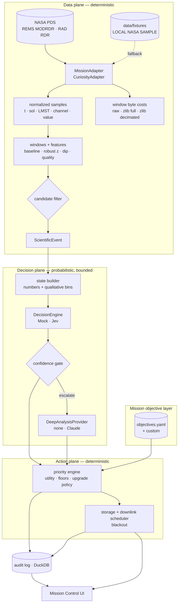

# DEEPSIFT architecture

DEEPSIFT separates **what the data says** (data plane), **what a model thinks** (decision plane), **what
the mission wants** (objective layer) and **what actually happens** (priority, storage, downlink) so that
each can be replaced, measured and audited independently.



## Data plane

**`MissionAdapter`** (`deepsift/adapters/base.py`) is the only mission-specific surface:
`load()`, `normalize()`, `window_key(instrument)`, `metadata()`, `extract_events()`. `normalize()` returns
a long-format sample table plus per-window byte costs measured on the original archival records.
Everything downstream is mission-agnostic, so a Perseverance MEDA, lunar or Earth-observation adapter
plugs in without pipeline changes.

**`CuriosityAdapter`**
* REMS MODRDR: 40-column fixed-length ASCII (layout from `MODRDR6.FMT`), `-999` missing constant
  removed, UTC from the label's `SPACECRAFT_CLOCK_START_COUNT`/`START_TIME` pair, sol and LMST from the
  record's LMST string.
* RAD RDR: parses `[OBSERVATION: NN]` blocks for `START_OBS_UTC` and the dosimetry total-dose elements.
  Sol/LMST are derived from UTC via a linear fit on REMS (the `START_OBS_MARS` field does not advance
  per observation in these products). Fitted sol length 88,775.244 s.
* Windows: REMS — 5-minute LMST-aligned windows keyed `(sol, LMST slot)`, which never straddle local
  midnight and line up across sols; RAD — one window per integration.
* Byte costs per window: raw record bytes; `full` = zlib(records); `compressed` = zlib(1-in-N records);
  `summary` = length of the event's JSON feature summary.

**Features** (`deepsift/features/extract.py`): per (instrument, channel, window) — n, mean, std, min,
max, slope, first-difference std, flat fraction, dip below a 60-sample running median, missing fraction
(on a complete window × channel grid so dropouts are visible). **Baseline**: for each of the previous
`baseline_sols` sols, the window whose mean LMST is nearest (±10 min); median/MAD across those sols →
robust z. Fewer than three matching sols → `insufficient` (no level flag). Causal rarity = rank of |z|
among earlier windows. Novelty = 1 − max cosine similarity of an event signature to earlier events.

**Candidate filter** (`flag_windows`): level (|z| ≥ threshold), pressure dip, stuck value, dropout,
noise, physical range. Flagged windows adjacent in sequence or within `merge_gap_s` merge into one
`ScientificEvent` with per-channel features, trigger reasons, source products and byte costs.

## Decision plane

**`DecisionEngine`** (`deepsift/decision/base.py`): `decide(events) → EngineDecision[]`, never raises for
a single event. Implementations:

* `MockDecisionEngine` — deterministic heuristic (softmax over hand-set logits). `is_real_model = False`
  propagates to every UI label and benchmark row.
* `JevDecisionEngine` — the only file importing `typesafe_sdk`. One `system_one` call per event with all
  five questions (parallel inside Jev), thread-pooled across events, errors recorded not raised,
  `usage.input_tokens × price` recorded as cost.

**Questions** (`questions.py`) are engine-agnostic specs; the Jev adapter maps them to SDK `Choice` /
`Noul`. They do not mention the objective.

**State builder** (`state.py`) sends aggregated features only, each numeric value paired with a
deterministic qualitative descriptor. The exact state is stored with the decision and shown in the UI.

**Gating** (`gating.py`): confidence = min(confidence of `science_value`, `event_type`).
`AUTO` ≥ auto threshold; `UNCERTAIN` in [uncertain, auto); below → `ESCALATED` if a deep provider exists,
otherwise `FALLBACK` to `rules_decision`. Engine errors → `ENGINE_ERROR` → rules. An engine can also
request escalation via `needs_deep_analysis`.

**Deep analysis** (`deep.py`): `DeepAnalysisProvider.analyze(state, mission_context, objective, history)`.
`ClaudeDeepAnalysis` uses the Anthropic SDK with a JSON-schema output (bounded verdict + short rationale)
and server-side refusal fallbacks. Its verdict is blended 50/50 into the engine distributions.
`NoDeepAnalysis` makes the unavailable case explicit.

## Mission objective layer

`config/objectives.yaml` holds presets (Balanced Science, Atmospheric Science, Radiation Monitoring,
Engineering Health, Rare Event Discovery); custom objectives are validated `MissionObjective` records.
An objective contributes:
* `mission_relevance = max(Σ P(type)·type_weight, max flagged-channel weight)`
* optional `priority_weights` overriding the global utility weights.

Because the engine's probabilities are stored, changing objective recomputes utility for every event in
milliseconds with zero engine calls; the UI shows BEFORE/AFTER ranks and action changes.

## Action plane

**Priority engine** (`priority/engine.py`) — pure functions of (features, effective decision, gate,
objective, config):
```
utility = (1 − λ(1 − conf)) × Σ w_k · term_k
action  = threshold(utility) → uncertain floor → instrument-failure floor → one-level engine upgrade (AUTO only)
density = utility / KB(product)^β
```
**Explanations** are assembled from trigger reasons, feature facts, gate reason and policy notes.
**Counterfactuals** (`priority/counterfactual.py`) solve for the value of each input (and confidence) at
which the action changes, verify by re-running `decide_action`, and re-score under every objective.

**Scheduler** (`simulation/scheduler.py`) — discrete-event simulation on fractional-sol time: raw bytes
accrue per window; each event's product enters storage when the event completes; background data becomes
a per-sol summary; relay passes (default 2/sol) send by descending utility, packetized across passes.
Storage pressure degrades products one level at a time — unprotected lowest-density first, products
with utility ≥ protect threshold last. Blackout: passes are missed and blackout storage capacity applies;
at reconnect a report lists data collected/retained/discarded, important events and the queue.

## Evaluation layer

`evaluation/injection.py` (nine injection kinds, seeded, tagged), `labels.py` (documented / synthetic /
human, never merged with predictions), `benchmark.py` (five strategies, common byte allocator, metrics,
per-label outcomes, stored JSON with seeds and config).

## UI

Next.js App Router, client components, custom SVG charts (no chart library). Pages: Mission Control
(replay clock 1×–10k×, KPIs, telemetry strips, event space, inspector, objective panel, timeline),
Blackout, Experiments, Data Explorer, Audit, Config, Research. Colour: three validated categorical hues
(atmospheric/radiation/thermal) plus neutral shapes for the other classes; an ordinal single-hue ramp for
downlink actions; status colours reserved for system state.

## Audit architecture

DuckDB (`data/processed/audit.duckdb`):

| table | contents |
|---|---|
| `runs` | run id, time, pipeline version, config version, engine, deep provider, objective, data source, sols, timings |
| `decisions` | per event per run: engine answers (JSON), deep verdict, gate, confidence, objective JSON, config version, full event JSON, priority breakdown, proposed + final action, explanation |
| `config_versions` | content-hashed config snapshots |
| `config_changes` | from → to version, path-level diff, note |
| `labels` | human labels (source `HUMAN_LABEL`) |

Re-scores (objective or priority/gating changes) are recorded as their own runs. `POST
/api/audit/reproduce` rebuilds a decision from the stored event, answers, objective and config version
and reports whether utility and action match exactly.
