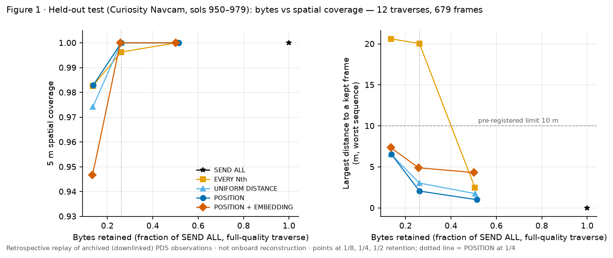
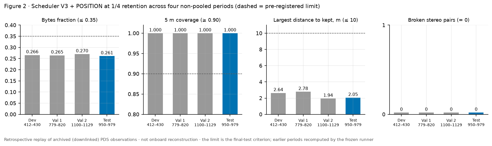
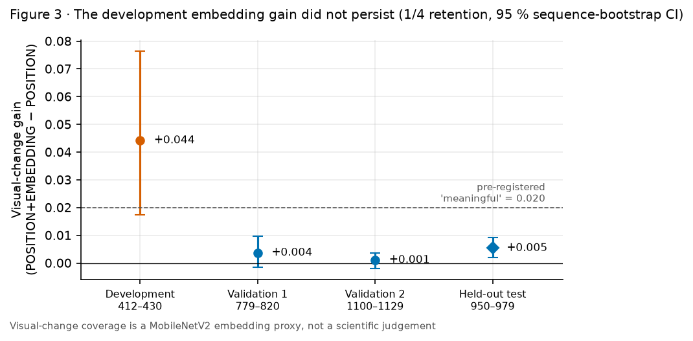
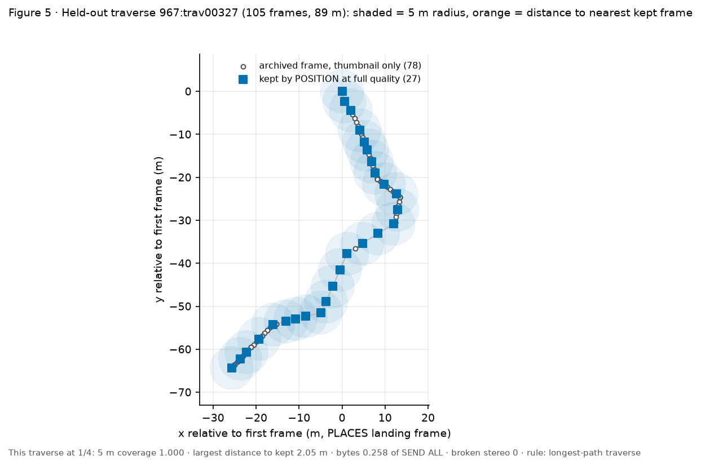
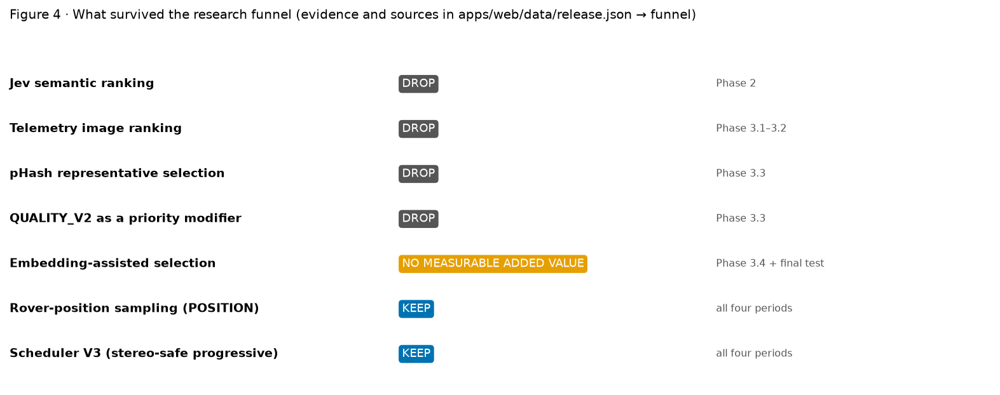

# Rover Geometry Outperformed Learned Signals in Bandwidth-Constrained Navcam Downlink Prioritization: A Pre-registered Retrospective Study on Curiosity Data

*DEEPSIFT v1 research release (tag `deepsift-v1-research`). An independent research prototype; not affiliated with,
reviewed or validated by NASA or JPL.*

**Keywords:** onboard autonomy · downlink prioritization · Mars Science Laboratory · Navcam · pre-registration ·
negative results · reproducibility

## Abstract

Planetary rovers acquire more data than their relay links can return, so onboard or ground prioritization must decide
what is transmitted first. We report a retrospective study that replays archived Mars Science Laboratory (Curiosity) data
from the Planetary Data System (PDS) under simulated bandwidth limits.

The study evaluated a sequence of candidate signals [1–4, 7–9]:
- deterministic rules;
- statistical anomaly scores;
- a local edge model;
- a semantic decision model (TypeSafe's Jev);
- environmental-telemetry context;
- perceptual hashing (pHash);
- a learned image-quality detector;
- MobileNetV2 image embeddings;
- rover-position sampling;
- a stereo-safe progressive downlink scheduler.

Methods were tuned on one development period, checked on two validation periods, and the surviving claim was tested
once on a held-out Navcam interval (sols 950–979). Each pass/fail rule was committed before the data that tested it
was downloaded.

On the held-out interval, farthest-point sampling on rover position combined with the stereo-safe scheduler kept 1/4 of
traverse frames at full quality. It used 26.1 % of full-quality traverse bytes, kept 5 m spatial coverage at 1.000,
left no archived traverse frame more than 2.05 m from a kept frame, and broke no stereo pairs.

The more complex signals did not earn a primary role:
- Jev did not improve candidate ranking;
- telemetry context did not help image selection;
- constrained pHash and the quality detector failed validation;
- embedding-assisted selection added no meaningful visual-change coverage outside development (+0.001 to +0.005
  against a pre-registered +0.020 threshold).

The results are limited by PDS survivorship bias (only downlinked observations exist), interpolated rover positions,
a simulated compressed stereo tier, and one rover, one camera and four sol windows.

## 1. Introduction

A Mars rover's imaging and environmental instruments can produce more data than relay passes carry, and storage
between passes is finite. Operations teams therefore prioritize: some products are downlinked at full quality, others
as thumbnails or summaries, and others later or never. As autonomy increases, part of this decision may move onboard,
where it must be cheap, predictable and explainable.

Many candidate signals could inform such a decision, including anomaly statistics, semantic judgments from a language
model, environmental context, image similarity and learned image representations. It is easy to find a signal that
helps on the data it was tuned on. It is harder to find one that still helps on data it has never seen.

DEEPSIFT is a measurement harness for that second question. Its main contribution is methodological: a staged,
pre-registered protocol in which each candidate signal must survive development, validation and a single held-out
test. Its main empirical finding is negative for complexity and positive for geometry. The only image-selection signal
that generalized was the rover's own position.

## 2. Research question

> Which signals actually help decide what should be transmitted, under a fixed downlink budget, on data the method was
> not tuned on?

**Phase 2 (telemetry).** Does a fast semantic decision model improve the ordering of already-detected REMS/RAD
candidate events over deterministic and statistical baselines at equal bytes?

**Phase 3 (imagery).** For rover traverse imaging, how much downlink can be removed while preserving spatial coverage
(and, secondarily, visual change) without breaking stereo pairs?

## 3. Data

All data are public PDS archives. They were downloaded with their URLs, labels and SHA-256 values recorded in committed
manifests.

- **REMS** [1] (Rover Environmental Monitoring Station) MODRDR, PDS Atmospheres Node: pressure, air and ground temperature,
  UV and humidity.
- **RAD** [2] (Radiation Assessment Detector) RDR, PDS PPI Node: dose rates.
- **Navcam** raw EDR [3] (MSLNAV_0XXX, PDS Imaging Node): left/right stereo engineering cameras. The products include full
  frames, downsampled and subframe tiers and 64-pixel thumbnails, each with ICER [5] or LOCO [6] compression metadata.
  Downlink size is estimated from the label as LINES × LINE_SAMPLES × INST_CMPRS_RATE / 8.
- **PLACES** [4] (`localized_interp.csv`, PDS): rover localizations by site/drive/pose. Frames are matched to the exact
  pose where available, and otherwise to the nearest pose within the same site and drive.

**Phase 3 periods.** Periods are reported separately and never pooled.

*Table 1. Phase 3 data periods.*

| period | sols | acquisitions | traverse sequences (≥ 10 frames) |
|---|---|---|---|
| development | 412–430 | 609 | 10 |
| validation 1 | 779–820 | 906 | 11 |
| validation 2 | 1100–1129 | 553 | 8 |
| held-out test | 950–979 | 1,194 | 12 (679 frames) |

**Interval selection.** The test and validation 2 intervals were selected by deterministic rules from PDS directory
listings alone, without reading image content. The rules required:
- a minimum number of active sols and acquisitions;
- REMS and RAD availability;
- no solar-conjunction moratorium;
- reproducible listings.

**Survivorship bias.** The PDS holds only what the mission chose to downlink. Every result in this paper concerns
re-prioritizing archived observations, not reconstructing the onboard stream.

## 4. System architecture

The released primary path (`deepsift/evaluation/phase3_pipeline.py`) is deliberately small:

1. **Acquisition grouping.** Navcam products are grouped by spacecraft-clock capture instant. A left/right stereo pair
   plus its thumbnails is one acquisition, and the two eyes are never separated.
2. **Position-aware selection (POSITION).** Within each traverse sequence, farthest-point sampling [7] on the Euclidean
   distance between PLACES positions keeps k = ⌈fraction × frames⌉ frames, starting from the first frame.
3. **Scheduler V3 (stereo-safe progressive).** The scheduler fills tiers in strategy order: metadata, then a
   THUMBNAIL_PAIR for every acquisition, then a COMPRESSED_STEREO_PAIR, then a FULL_STEREO_PAIR. It stops at the first
   increment that does not fit. Every tier of a stereo acquisition carries both eyes.
   - Coverage is therefore a prefix of the order and cannot decrease as the budget grows.
   - A stereo pair is "usable" only when both eyes are sent.
   - The compressed stereo tier is DEEPSIFT's own JPEG q50 re-encoding, a **simulated product tier**. Traverse results
     use only the NASA label-estimated full and thumbnail tiers.

The experimental modules are kept for reproducibility but excluded from the primary path:
- pHash representatives;
- the QUALITY_V2 detector, which can only raise a `QUALITY_SUSPECT` flag;
- telemetry ranking;
- Jev.

A unit test checks that none of them can change a primary decision.

## 5. Experimental design

Every stage followed the same pattern:
1. declare the configuration and the pass/fail rule;
2. commit them to git;
3. only then download or analyse the data that tests them.

Runners recompute the configuration hash and the SHA-256 of each listed source file, and refuse to start if anything
differs. Every stochastic component has a recorded seed, and there is no bootstrap except the pre-declared
sequence-level interval [10].

**Traverse metrics.** For each traverse and retention fraction:
- bytes, as a fraction of sending every frame at full quality (kept frames sent as full pairs, the others as thumbnail
  pairs);
- **5 m spatial coverage**: the fraction of archived frames within 5 m of a kept frame;
- **largest distance to a kept frame**: the maximum, over archived frames, of the distance to the nearest kept frame;
- gap statistics;
- **visual-change coverage**: the mean over frames of the best MobileNetV2 [8] cosine similarity to a kept frame. This is a
  proxy, not a scientific judgement;
- stereo integrity.

**Why "largest distance to a kept frame" rather than a gap metric.** On development, the median spacing between
consecutive native frames was 0 m (several frames per rover stop), and stops were about 19.5 m apart. Gap-based metrics
therefore measured the rover's drive step rather than the selection. The distance-to-kept metric is 0 for SEND ALL at
any frame density, and it jumps to about 20 m when a method drops a whole stop. The metric and its 10 m threshold were
chosen on development data. The need for such a metric was prompted by a failure on validation 1 (Section 8).

## 6. Phase 2 — semantic decision evaluation (REMS / RAD)

**Setup.**
- Candidate events were detected deterministically from REMS and RAD data.
- The candidates were ranked by deterministic rules, statistical scores, a local edge model and Jev, a bounded-output
  semantic model reached through an API.
- All rankers shared the same byte budget.
- Detection and ranking were separated: Jev could only reorder events the frozen detector surfaced.

**Result.**
- Across successive pre-registered stages, Jev did not provide a measurable ranking improvement.
- In the final Jev design pilot (1,500 live calls, $0.050), its AUROC difference from deterministic rules was +0.006,
  with a 95 % interval from −0.020 to +0.037.
- The pre-registered stop rule then discontinued Jev for the ranking role.
- In mock-engine held-out benchmarks, detection recall capped every event strategy (63–68 % high-severity recall), and
  a rules-plus-statistical hybrid led above about 1 % of raw bytes.
- A later text-only pairwise-preference probe of Jev on image metadata (Phase 3.2) was stable and showed no A/B
  positional bias, but it agreed with none of the tested strategies. It was kept only as an auxiliary diagnostic, never
  as ground truth.

## 7. Phase 3 — image downlink prioritization

**Phase 3.0–3.1 (development).**
- A Navcam baseline and synthetic controls were built. The controls are perturbed copies of archived images that inject
  engineering faults, visual novelty and near-duplicates.
- A first greedy scheduler was found to be non-monotonic: more budget could reduce coverage.
- A progressive replacement fixed monotonicity but broke stereo, because its compressed tier carried one eye.

**Phase 3.2 (development).** Scheduler V3 carried both eyes in every tier. Its behaviour was confirmed on a dense budget
grid and by random property tests. A contract-checked synthetic generator removed clipping artefacts that had leaked
into the quality detector. A traverse experiment compared the six sampling methods.

**Phase 3.3 (validation 1, 779–820).** The first out-of-sample check, using configuration and rules frozen before the
download (Section 8).

**Phase 3.4 (simplification and validation 2, 1100–1129).**
- The pipeline was reduced to the components that survived.
- The spatial metric was redefined on development data only.
- A new claim, a numeric definition of "meaningful" embedding value, and a decision rule for spending the test set
  were pre-registered.
- A fresh interval was selected from listings and tested.

## 8. Development and validation

**Validation 1 (Phase 3.3).**
- Scheduler V3 held: 0 monotonicity violations and 0 single-eye stereo pairs.
- MobileNetV2 kept a distinct visual-change signal that pHash lacks.
- The quality detector **failed**. Its false-positive rate rose from 3.6 % on development to 10.6 % on validation 1,
  concentrated in upward-pointing, low-texture frames (43 % flagged above the horizon against 2.2 % at or below it).
- Constrained pHash **failed** its safety rule, with false-merge rates of 0.15–0.19 against a 0.05 limit, and it
  compressed traverses by at most 1.03×.
- POSITION + EMBEDDING kept bytes, coverage, visual-change coverage and stereo, but failed a pre-declared worst-gap
  rule defined relative to native frame spacing. Validation 1 traverses were about ten times denser than development,
  so the relative limit shrank from about 39 m to 3.8 m. The verdict was recorded as PARTIALLY GENERALIZES and never
  rewritten.

**Validation 2 (Phase 3.4).**
- The simplified claim passed.
- The decision rule allowed the test to proceed, but only through its "equivalent, no regression" branch.
- The embedding's visual-change gain over POSITION at 1/4 was +0.001 (95 % CI −0.002 to +0.004), and +0.004 on
  validation 1, against +0.044 on development.
- The final primary claim was therefore restated as Scheduler V3 + POSITION. POSITION + EMBEDDING was kept only as a
  secondary comparator.

## 9. Final held-out test

The test configuration (`config/phase3_final_test_config.json`, hash `6f35d7fc…`) was committed at 17:03:26 UTC. The
first test image was written at 17:03:50 UTC. The analysis ran once and nothing changed afterwards.

**Primary criterion.** Scheduler V3 + POSITION at 1/4 retention, binary:

*Table 2. Pre-registered primary criterion and held-out result
(`artifacts/phase3_final/20260926T174018-phase3-final-test-e4e2/results.json` → `primary`).*

| criterion | threshold | test |
|---|---|---|
| bytes fraction | ≤ 0.35 | **0.261** |
| 5 m coverage | ≥ 0.90 | **1.000** |
| largest distance to a kept frame, every traverse | ≤ 10 m | **2.05 m** |
| broken stereo pairs | 0 | **0** (174 pairs kept whole) |
| Scheduler V3 monotonic and stereo-safe | 0 violations | **0 / 0** |

**Result: PASS.**

**Secondary question.** Does POSITION + EMBEDDING gain at least 0.020 in visual-change coverage without losing more than
0.01 of coverage?
- Visual-change coverage: 0.950 for POSITION, 0.956 for POSITION + EMBEDDING.
- Gain: +0.0054, 95 % CI [+0.0021, +0.0093]; coverage difference 0.000; largest distance 2.84 m worse.
- Conclusion: **no measurable added value**, since the gain is positive but about a quarter of the threshold.

## 10. Results

**Held-out test, 1/4 retention** (figure 1):

*Table 3. Held-out test at 1/4 retention, all frozen selection methods (`results.json` → `traverse.summary`).*

| method | bytes | 5 m coverage | largest distance to kept |
|---|---|---|---|
| POSITION | 0.261 | 1.000 | 2.05 m |
| UNIFORM_DISTANCE | 0.260 | 1.000 | 3.03 m |
| POSITION + EMBEDDING | 0.257 | 1.000 | 4.89 m |
| EVERY_NTH | 0.261 | 0.996 | 20.04 m |

EVERY_NTH drops whole rover stops.

*Figure 1. Held-out test (sols 950–979; 12 traverses, 679 frames). Left: bytes retained vs 5 m spatial coverage at 1/8,
1/4 and 1/2 retention. Right: bytes vs the largest distance from any archived frame to a kept frame; the dashed line is
the pre-registered 10 m limit. Source: final-test `results.json` → `traverse.summary`.*

**POSITION across all four periods** (figure 2):
- bytes 0.266 / 0.265 / 0.270 / 0.261;
- 5 m coverage 1.000 in every period;
- largest distance 2.64 / 2.78 / 1.94 / 2.05 m;
- 0 broken stereo pairs.

*Figure 2. Scheduler V3 + POSITION at 1/4 retention in four non-pooled periods. Dashed lines are the final-test limits,
which were pre-registered for the test only. Source: final-test `results.json` → `four_period`.*

**Embedding gain over POSITION** (figure 3): +0.044 on development, then +0.004, +0.001 and +0.005.

*Figure 3. Visual-change gain of POSITION + EMBEDDING over POSITION at 1/4 retention, with 95 % sequence-bootstrap
intervals. The dashed line is the pre-registered 0.020 "meaningful" threshold.*

*Figure 5. Example held-out traverse 967:trav00327, chosen by a fixed rule (the longest path; 105 frames, 89 m); it is not claimed to be statistically representative of all traverses. Filled squares: frames
kept at full quality by POSITION at 1/4. Hollow circles: thumbnail-only frames. Shaded discs: 5 m radius. Orange lines:
distance from each thumbnail-only frame to its nearest kept frame.*

## 11. Negative results

These are reported as findings, not footnotes (figure 4):

*Figure 4. What survived the research funnel. Verdicts come from pre-registered rules; evidence and sources are in
`apps/web/data/release.json` → `funnel`.*

- **Jev semantic ranking:** no measurable improvement in candidate ranking. Discontinued by pre-registered rule.
- **Telemetry image ranking:** image-independent by construction, and the weakest coverage of six strategies (at 1 %
  budget under Scheduler V3: 7 usable acquisitions at 1 rover position).
- **pHash representative selection [9]:** unsafe scene merges on validation, and negligible compression.
- **QUALITY_V2 as a priority modifier:** its false-positive rate tripled out of sample. Retained only as a diagnostic
  flag.
- **Embedding-assisted selection:** it detects synthetic visual change that pHash misses, but it added no meaningful
  final selection value outside development.
- **The first two schedulers:** V1 was non-monotonic; V2 dropped stereo. Both were superseded by V3.

## 12. Limitations

- **PDS survivorship bias.** Archived, downlinked observations only; no onboard-stream reconstruction.
- **Simulated compressed tier.** The compressed stereo tier is simulated. Byte costs are label estimates, not flight
  packetization.
- **Interpolated positions.** Positions are PLACES interpolations, mostly the nearest pose within a drive.
- **Narrow scope.** One rover (Curiosity), one camera (Navcam), traverse sequences only, four sol windows.
- **Proxy metrics.** Visual-change coverage is an embedding proxy, and spatial coverage is geometric; neither measures
  scientific value.
- **No hardware model.** No flight hardware, power, thermal or compute-budget model.
- **No NASA validation.**
- **Single-use test.** The held-out interval is now used up; any modified method needs a new test interval.

## 13. Discussion

The result is modest and specific. For traverse imaging, knowing where the rover was is enough to choose a quarter of
the frames that keep every archived viewpoint within a couple of metres of a full-quality one. The more sophisticated
signals either did not generalize or added nothing measurable. This fits a familiar pattern: signals tuned on one
period can look strong there and still fail to transfer.

The protocol mattered as much as the methods:
- Pre-registration exposed a development-only embedding gain that would otherwise have been reported as a benefit.
- The validation 1 failure of a density-relative gap rule forced a better metric, which was defined before fresh data
  was seen.
- Keeping each failed verdict unchanged was necessary for the final claim to mean anything.

## 14. Future work

The following would each need new, untouched test data:
- other cameras and rovers;
- non-traverse sequences;
- an orientation-aware quality detector (QUALITY_V3, currently only a post-validation design idea);
- flight-like compute and power constraints;
- assessment by mission scientists of whether spatially complete downlink preserves the observations they need.

## 15. Reproducibility

| item | location |
|---|---|
| frozen configurations | `config/phase3_3_validation_config.json`, `config/phase3_4_validation_config.json`, `config/phase3_final_test_config.json` |
| splits | `data/splits/phase3_splits.json`, `data/splits/phase3_validation2.json` |
| dataset manifests (URLs, SHA-256) | `data/manifests/navcam_*.json` |
| run artifacts | `artifacts/phase3_3/`, `artifacts/phase3_4/`, `artifacts/phase3_final/` |
| integrity manifest (70 files, aggregate SHA-256) | `docs/release/science-artifacts.json` |
| verify integrity | `uv run python scripts/release_integrity.py --verify` |
| figures | `scripts/make_release_figures.py` (from frozen artifacts only) |

Git tags mark every stage, from `v0.1-baseline` to `phase3-final-test-complete`; the ordered list is on the web app's
`/reproducibility` page.

## References

1. Gómez-Elvira, J. et al. REMS: The Environmental Sensor Suite for the Mars Science Laboratory Rover. *Space Science
   Reviews* 170, 583–640 (2012). Data: MSL-M-REMS-5-MODRDR-V1.0, PDS Atmospheres Node.
2. Hassler, D. M. et al. The Radiation Assessment Detector (RAD) Investigation. *Space Science Reviews* 170, 503–558
   (2012). Data: MSL-M-RAD-3-RDR-V1.0, PDS Planetary Plasma Interactions Node.
3. Maki, J. et al. The Mars Science Laboratory Engineering Cameras. *Space Science Reviews* 170, 77–93 (2012). Data:
   MSLNAV_0XXX raw EDR, PDS Imaging Node, https://planetarydata.jpl.nasa.gov/img/data/msl/MSLNAV_0XXX/.
4. MSL PLACES localizations, `localized_interp.csv`, PDS Imaging Node,
   https://planetarydata.jpl.nasa.gov/img/data/msl/msl_places/.
5. Kiely, A. & Klimesh, M. The ICER Progressive Wavelet Image Compressor. *IPN Progress Report* 42-155 (2003).
6. Weinberger, M. J., Seroussi, G. & Sapiro, G. The LOCO-I Lossless Image Compression Algorithm. *IEEE Transactions on
   Image Processing* 9(8), 1309–1324 (2000).
7. Gonzalez, T. F. Clustering to Minimize the Maximum Intercluster Distance. *Theoretical Computer Science* 38, 293–306
   (1985).
8. Sandler, M. et al. MobileNetV2: Inverted Residuals and Linear Bottlenecks. *CVPR* (2018).
9. Zauner, C. *Implementation and Benchmarking of Perceptual Image Hash Functions.* Master's thesis, Upper Austria
   University of Applied Sciences (2010).
10. Efron, B. & Tibshirani, R. J. *An Introduction to the Bootstrap.* Chapman & Hall (1993).
